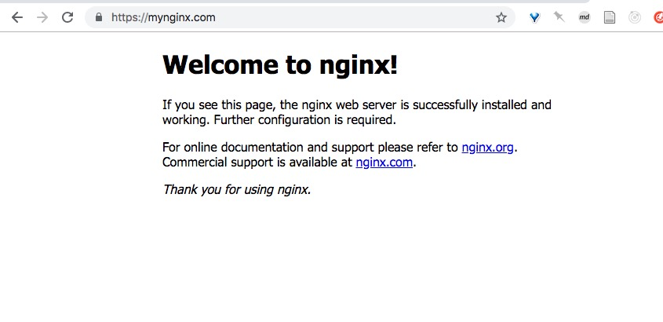

# k8s 如何在本地调试 SSL
* 本地搭建 k8s
* 准备 Dockerfile 
* 准备 ssl 证书文件并构建 Docker 镜像
* 运行 deploy 以及 service 并修改 host

## 本地搭建 k8s
macOS 本地搭建 k8s 请参考这个仓库：[maguowei/k8s-docker-for-mac: Docker for Mac开启 Kubernetes 集群](https://github.com/maguowei/k8s-docker-for-mac)

搭建好了之后，启动 Docker GUI 即可。

## 准备 Dockerfile 

```Dockerfile
FROM nginx:1.15.4-alpine
RUN cp /usr/share/zoneinfo/Asia/Shanghai /etc/localtime

ARG SSL_KEY=ssl-key
ARG SSL_CRT=ssl-crt
ARG SERVER_NAME=mynginx.com
ENV SSL_KEY ${SSL_KEY}
ENV SSL_CRT ${SSL_CRT}
ENV SERVER_NAME ${SERVER_NAME}

RUN mkdir -p /etc/nginx/ssl/
ADD ${SSL_KEY} /etc/nginx/ssl/ssl.key
ADD ${SSL_CRT} /etc/nginx/ssl/ssl.crt

COPY default.conf.template /etc/nginx/conf.d/
RUN export DOLLAR='$' && envsubst < /etc/nginx/conf.d/default.conf.template > /etc/nginx/conf.d/default.conf

EXPOSE 80 443
CMD ["nginx", "-g", "daemon off;"]
```

这里用了 template，以及  `ADD` 命令，这样我们就能方便的用环境变量控制 `server_name` 以及 SSL 证书了。

## 准备 ssl 证书文件并构建 Docker 镜像

```bash
$ mkdir envfiles && touch .env
$ echo "envfiles\n.env" >> .gitignore
```

参考这篇文章可以生成 chrome 不报错的证书，[How to get HTTPS working on your local development environment in 5 minutes](https://medium.freecodecamp.org/how-to-get-https-working-on-your-local-development-environment-in-5-minutes-7af615770eec)。

前3步参考上面文章，后面针对某个域名生成 ssl 文件，建议用我新增的脚本[local-cert-generator/g_ssl_for_domain.sh at master · scottming/local-cert-generator · GitHub](https://github.com/scottming/local-cert-generator/blob/master/g_ssl_for_domain.sh) 。

```bash
$ j local-cert-generator
$ ./g_ssl_for_domain.sh mynginx.com  /Users/scottming/Documents/ExRepos/k8s-nginx-ssl/envfiles # ./g_ssl_for_domain.sh <domian> <path>
```

`<path>` 参数建议换成代码文件根目录下的 `envfiles` 并把其添加到 .gitignore

接下来切合代码文件夹，设置环境变量(推荐 autoenv 自动检测 .env 文件)并构建镜像：

```
$ j k8s-nginx-ssl
$ echo "SSL_KEY=./envfiles/server.key\nSSL_CRT=./envfiles/server.crt\n" >> .env
$ docker build . -t k8s-nginx-ssl:v0.1.1 --build-arg SSL_CRT=$SSL_CRT --build-arg SSL_KEY=$SSL_KEY
```


## k8s 运行 deploy 及 svc

yaml 文件请参考本仓库：https://github.com/scottming/k8s-nginx-ssl-local

```
$ kubectl apply -f nginx-deploy.yaml
$ kubectl apply -f nginx-svc.yaml
```

k8s 运行情况：

```bash
$ kubectl get po
NAME                                    READY     STATUS    RESTARTS   AGE
k8s-nginx-ssl-deploy-68bfc469f7-6k9g9   1/1       Running   0          14m
```

```bash
$ kubectl get svc
NAME                    TYPE           CLUSTER-IP      EXTERNAL-IP   PORT(S)                      AGE
k8s-nginx-ssl-service   LoadBalancer   10.103.206.38   localhost     80:31598/TCP,443:31009/TCP   14m
kubernetes              ClusterIP      10.96.0.1       <none>        443/TCP                      4d
```

推荐用 Gas Mask 工具修改 host，新增以下内容

```host
127.0.0.1	mynginx.com
```

最终效果：




